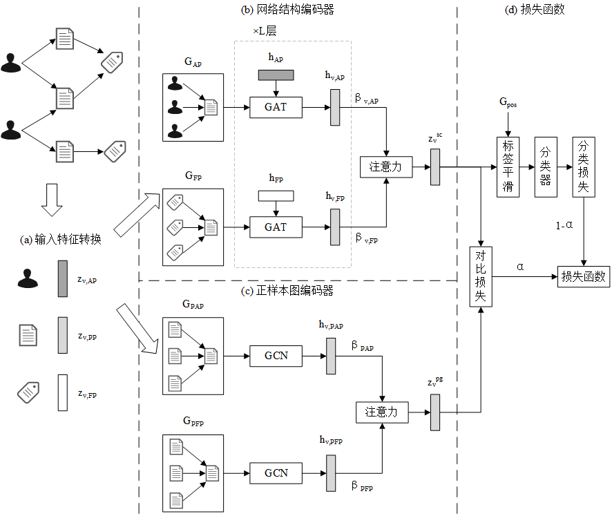
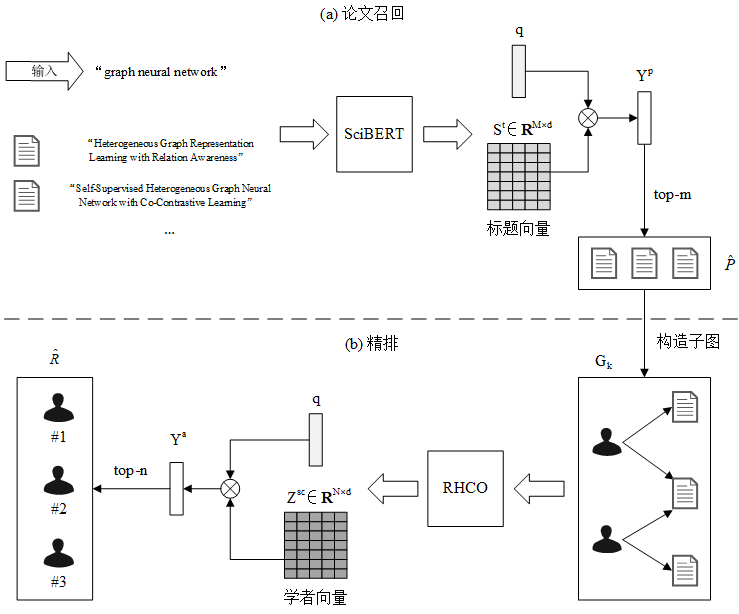
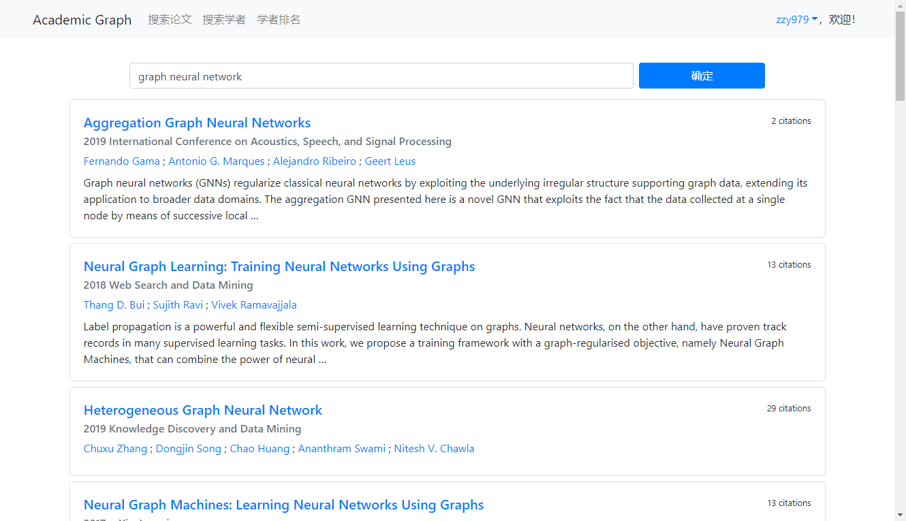
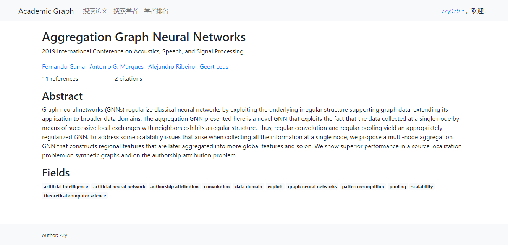
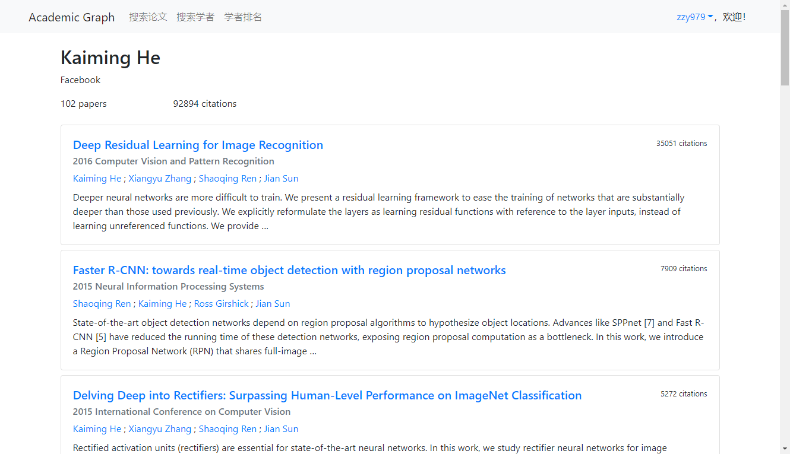

# GNN-Recommendation
毕业设计：基于图神经网络的异构图表示学习和推荐算法研究

## 目录结构
```
GNN-Recommendation/
    gnnrec/             算法模块顶级包
        hge/            异构图表示学习模块
        kgrec/          基于图神经网络的推荐算法模块
    data/               数据集目录（已添加.gitignore）
    model/              模型保存目录（已添加.gitignore）
    img/                图片目录
    academic_graph/     Django项目模块
    rank/               Django应用
    manage.py           Django管理脚本
```

## 安装依赖
Python 3.7

### CUDA 11.0
```shell
pip install -r requirements_cuda.txt
```

### CPU
```shell
pip install -r requirements.txt
```

## 异构图表示学习
基于对比学习的关系感知异构图神经网络(Relation-aware Heterogeneous Graph Neural Network with Contrastive Learning, RHCO)



### 实验
见 [readme](gnnrec/hge/readme.md)

## 基于图神经网络的推荐算法
基于图神经网络的学术推荐算法(Graph Neural Network based Academic Recommendation Algorithm, GARec)



### 实验
见 [readme](gnnrec/kgrec/readme.md)

## Django配置
### MySQL数据库配置
1. 创建数据库及用户
```sql
CREATE DATABASE academic_graph CHARACTER SET utf8mb4;
CREATE USER 'academic_graph'@'%' IDENTIFIED BY 'password';
GRANT ALL ON academic_graph.* TO 'academic_graph'@'%';
```

2. 在根目录下创建文件.mylogin.cnf
```ini
[client]
host = x.x.x.x
port = 3306
user = username
password = password
database = database
default-character-set = utf8mb4
```

3. 创建数据库表
```shell
python manage.py makemigrations --settings=academic_graph.settings.prod rank
python manage.py migrate --settings=academic_graph.settings.prod
```

4. 导入oag-cs数据集
```shell
python manage.py loadoagcs --settings=academic_graph.settings.prod
```
注：由于导入一次时间很长（约9小时），为了避免中途发生错误，可以先用data/oag/test中的测试数据调试一下

### 拷贝静态文件
```shell
python manage.py collectstatic --settings=academic_graph.settings.prod
```

### 启动Web服务器
```shell
export SECRET_KEY=xxx
python manage.py runserver --settings=academic_graph.settings.prod 0.0.0.0:8000
```

### 系统截图
搜索论文


论文详情


搜索学者


学者详情

